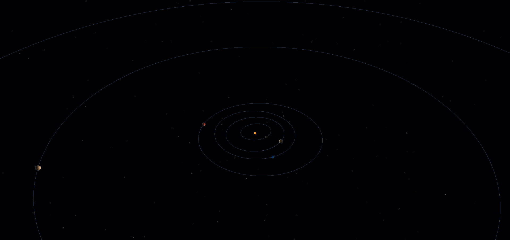
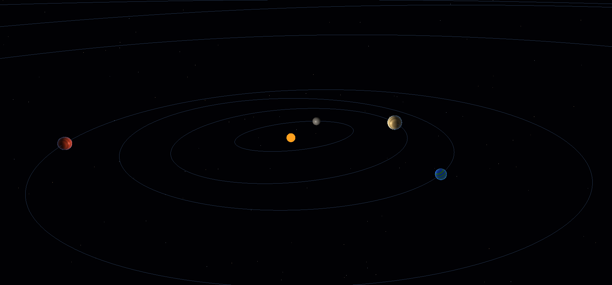

# Solarium

Solarium is a C++20 desktop Solar System explorer built around a real numerical
simulation core and a lightweight OpenGL renderer. It is designed to make the
structure and motion of the Solar System easy to explore while keeping physics,
astronomy, time, reference frames, and rendering as separate responsibilities.

> Solarium currently uses approximate visualization data. It is not NASA/JPL
> validated and does not claim authoritative astronomical accuracy. Ephemeris
> integration and numerical validation are the next scientific milestone.

## Screenshots







## Features

- C++20, CMake, Ninja, GLFW, OpenGL 3.3, and GLAD.
- Newtonian N-body gravity with Velocity Verlet, RK4, and adaptive RK45 support.
- Explicit astronomical time and reference-frame modules.
- Data-driven Sun, eight planets, and twenty major moons.
- Arbitrary parent-child celestial relationships.
- Parent-centered moon states compatible with future ephemeris providers.
- GPU-cached star field, smooth orbital curves, bounded trajectory trails, and Saturn rings.
- Directional solar lighting, axial rotation, atmospheric rim lighting, and procedural material variations.
- Screen-space body picking with selection highlighting.
- Free/orbit/follow camera behavior, focus, pan, zoom, and keyboard navigation.
- Pause, time-scale control, orbit visibility, trail visibility, and reset controls.

## Celestial Catalog

The default catalog contains:

- Sun
- Mercury, Venus, Earth, Mars, Jupiter, Saturn, Uranus, Neptune
- Earth: Moon
- Mars: Phobos, Deimos
- Jupiter: Io, Europa, Ganymede, Callisto
- Saturn: Mimas, Enceladus, Tethys, Dione, Rhea, Titan, Iapetus
- Uranus: Miranda, Ariel, Umbriel, Titania, Oberon
- Neptune: Triton

All body definitions live in the celestial registry rather than in OpenGL draw
code. A definition carries physical state, type, parent name, orbital parameters,
rotation parameters, and visual properties.

## Controls

| Input | Action |
| --- | --- |
| Left mouse drag | Orbit camera |
| Right mouse drag | Pan camera |
| Mouse wheel | Smooth zoom |
| `WASD` | Move camera target |
| `Q` / `E` | Move camera target vertically |
| Left click | Select a visible body |
| `F` | Focus selected body |
| `G` | Follow or stop following selected body |
| `V` | Toggle free and orbit camera modes |
| `O` | Toggle orbital curves |
| `P` | Toggle planet orbital curves |
| `M` | Toggle moon orbital curves |
| `L` | Show only the selected body's orbit |
| `T` | Toggle trajectory trails |
| `1` / `2` / `3` | Realistic / Presentation / Exploration scale |
| `Space` | Pause or resume simulation |
| `+` / `-` | Increase or decrease simulation speed |
| `R` | Reset simulation and camera |
| `Esc` | Exit |

The window title provides a compact live HUD with simulation state, time scale,
FPS, camera mode, orbit/trail state, and selected-body summary. The selected
body information is intentionally kept out of the physics and rendering APIs so
it can later be replaced by a richer UI layer.

## Physics And Rendering Scale

The simulation uses SI units: metres, kilograms, and seconds. Rendering converts
physical positions into astronomical-unit coordinates. Body and moon size
multipliers are visualization-only; they never alter gravity, integration, or
stored physical state.

Stars are generated on a distant sphere and remain fixed in the simulation frame.
Orbits are cached GPU line geometry. Trails use bounded buffers and record actual
integrated body states rather than an independent animation.

The three visualization modes change only renderer multipliers:

- **Realistic** keeps body sizes closest to physical proportions.
- **Presentation** is the default balanced view for system-wide exploration.
- **Exploration** enlarges bodies for close inspection of moons and surfaces.

## Architecture

```text
include/solarium/
  celestial/      body state, definitions, registry
  math/           vectors and constants
  orbital/        orbital conversion and Kepler utilities
  physics/        gravity and numerical integrators
  reference/      coordinate and reference-frame transforms
  simulation/     clock, configuration, simulation orchestration
  rendering/      camera, bodies, orbits, rings, stars, trails, picking
  time/           astronomical time and conversions

src/
  celestial/ physics/ orbital/ reference/ simulation/ time/ rendering/

assets/shaders/
  planet, orbit, ring, star, and trail shader programs
```

The application composes these modules in `app/main.cpp`; the numerical solver
does not know about OpenGL, and renderers consume already-available body state.

## Build

From the repository root in an MSYS2 UCRT64 environment:

```text
cmake --preset default
cmake --build build
ctest --test-dir build --output-on-failure
```

Run `build/solarium.exe` from the repository root so relative shader paths such
as `assets/shaders/planet.vert` resolve correctly.

## Data Status And Future Ephemerides

The included masses, radii, initial states, orbital parameters, and visual values
are approximate defaults for exploration. They are deliberately not presented as
NASA/JPL data. The registry and simulation state are structured so a future
`EphemerisProvider` can supply epoch-aware, reference-frame-aware states without
requiring changes to the renderers. Possible future providers include analytical,
file-backed, and JPL-backed implementations.

### JPL Horizons Provider

The V2 provider uses the documented JPL Horizons API endpoint, not website HTML.
`JplHorizonsConfiguration` controls the API URL, timeout, user-agent, default
center, default frame, time scale, and requested output units. A request supplies
the `BodyId`, Julian Date, center, reference frame, and time scale. Horizons
state-vector output is requested as `KM-S` and converted to Solarium's canonical
meters and meters-per-second state.

The provider validates the HTTP status, `$$SOE`/`$$EOE` block, epoch, numeric
fields, output units, ICRF frame, and returned center before constructing a
canonical state. Source metadata identifies `JPL Horizons` and the API response;
the result should not be interpreted as a blanket claim of NASA accuracy.

Networking is isolated behind `HttpClient`; the default implementation uses
libcurl when available. A bounded in-memory cache is enabled by default and is
explicitly replaceable by a future disk or offline cache. Normal CTest runs use
recorded fixtures and do not require internet access. Live tests are disabled by
default and can be enabled with `-DSOLARIUM_ENABLE_LIVE_EPHEMERIS_TESTS=ON`.

### NAIF SPICE Provider

`SpiceEphemerisProvider` uses the official NAIF CSPICE toolkit when
`SOLARIUM_ENABLE_SPICE=ON`; it does not parse SPK binaries itself. SPK files
provide ephemerides, while PCK, LSK, and FK kernels provide planetary constants,
leap-second data, and frame definitions as required by the configured kernel
set. Meta-kernels can be configured with relative paths under the configured
kernel directory.

`SpiceKernelManager` validates kernel categories and extensions before loading,
tracks loaded-kernel provenance, and checks SPK coverage before every query.
States are requested through CSPICE state-query APIs in the configured frame.
SPICE state vectors are returned in kilometers and kilometers per second and
are converted to Solarium's canonical meters and meters per second. Julian Dates
are converted through CSPICE `str2et_c`: UTC, TT, and TDB are passed as explicit
time scales to obtain ET seconds past J2000; UTC is never treated as TDB.

The default build keeps SPICE disabled and does not require CSPICE. Install the
official toolkit from [NAIF](https://naif.jpl.nasa.gov/naif/toolkit.html), then
configure with `-DSOLARIUM_ENABLE_SPICE=ON` and provide the toolkit include and
library paths through CMake discovery. Kernel files remain external configuration
and are not downloaded or bundled by Solarium. See the official
[SPICE documentation](https://naif.jpl.nasa.gov/naif/documentation.html) and
[SPK documentation](https://naif.jpl.nasa.gov/pub/naif/toolkit_docs/C/cspice/spk.html)
for kernel formats and provenance details.

## Quality And Performance

The current default targets modest integrated or entry-level GPUs: static meshes
are cached, stars use one vertex buffer, orbit geometry is generated once, and
trails are bounded. A formal LOW/MEDIUM/HIGH quality profile is planned for the
next rendering pass; current geometry counts are intentionally conservative.

## License

See [LICENSE](LICENSE).
